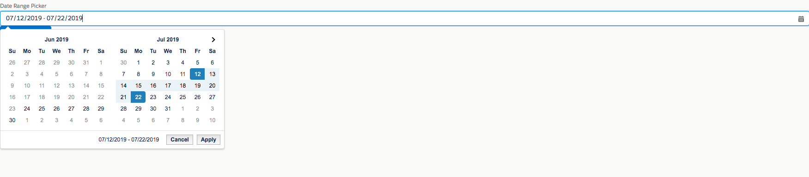

# SF-Lightning-Custom-Input-Dates-Range-Field
Custom Lightning input date field by jQuery + Date Range Picker 

1) Upload daterangepicker.zip and jquery.min.js to static resource with names 'daterangepicker' and 'jQuery' respectively
2) Add DateRangePickerWithTwoCalendars to your Lightning component.
